Email Security Plus for Mozilla Thunderbird
===========================================

Email Security Plus is an anti-spam add-on for Mozilla Thunderbird.

**Please, note that Email Security Plus was firstly released on the _Mozilla Add-On Developer Hub_ on May 2012 and finally discontinued on December 2014. The source code uploaded here was retrieved from some local archives and code-dumped only afterwards.**

Published at: https://addons.mozilla.org/en-US/thunderbird/addon/emailsecurityplus

## Overview

Email Security Plus supports from Thunderbird _3_ to _31_, and includes the following features:

 * **Enhance Thunderbird native anti-spam engine**: manage a list of captures to catch spam and hoax emails, while training Thunderbird's native bayesian filter
    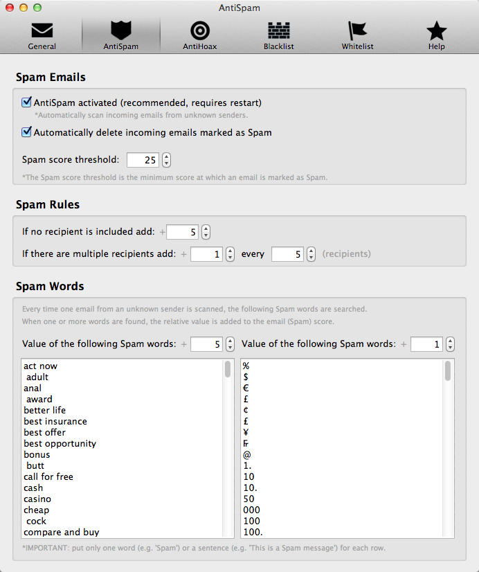
    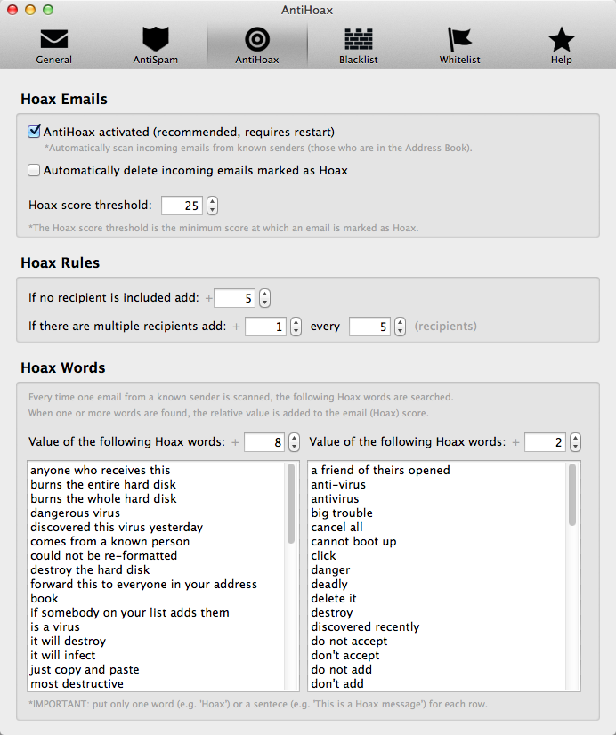

 * **Automated Scans:** automatically check incoming messages and delete the ones identified as junk
    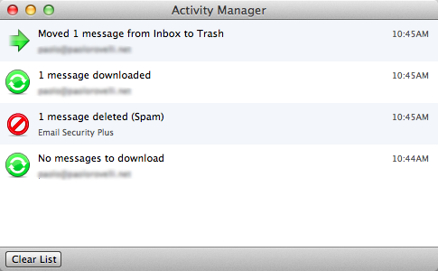

 * **Manual Scans:** manually select local messages/folders and scan them
    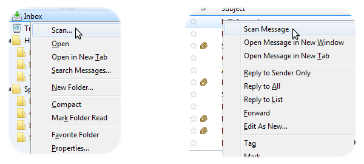
    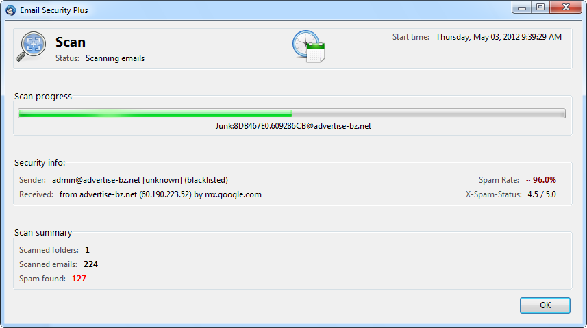

 * **Blacklist:** manage a list of sender domains/addresses whose messages should be automatically marked as junk
    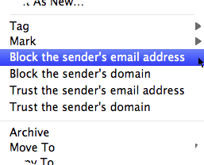
    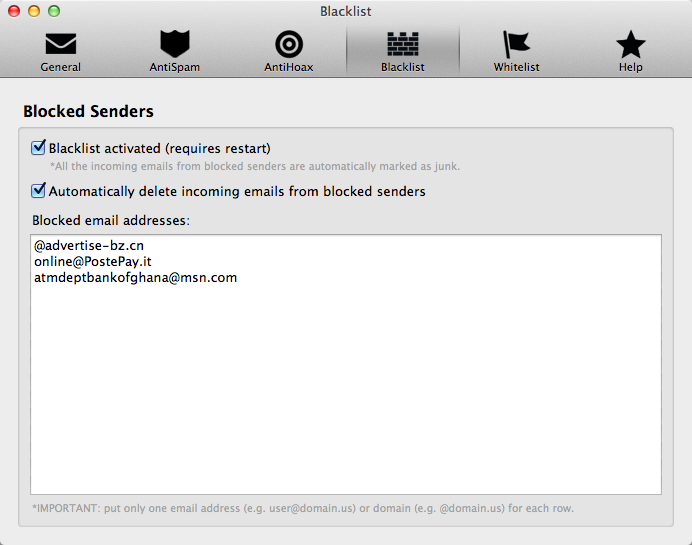

 * **Whitelist:** manage a list of sender domains/addresses whose messages should _never_ be marked as junk
    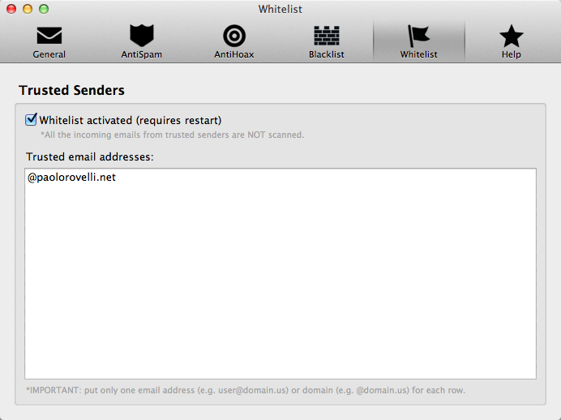

 * **Extend Thunderbird extended header view**: optionally show the `Received` and `X-Spam-Status` headers
    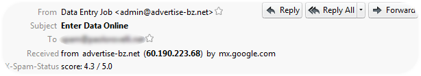

## Stats & Reviews

Metrics from the Mozilla Add-On Developer Hub:

 * Average Rating: _4.7_ out of _5_ stars
 * Average Daily Users: _1.602_
 * Average Weekly Downloads: _217_

Partial list of reviews from the Mozilla Add-On Developer Hub:

 * _5_ out of _5_ stars (September 17, 2014): https://addons.mozilla.org/addon/emailsecurityplus/reviews/626682
    > This add-on is a huge improvement over Thunderbird's native junk filter, because it allows one to train Thunderbird over time to actually block entire domains from which Spam originates. I selected all mail in my Junk filter, after verifying it was indeed junk, and then right-clicked and "Block Domain", and this add-on added all those domains so I will never see their emails again. In addition, I loaded the top 1000 spam domains from Spamhaus into the Blacklist. The Whitelist feature, on the other hand, is extremely useful to teach Thunderbird to let certain trusted domains and email addresses through all the time. In conclusion, this add-on improves Thunderbird by a factor of about a thousand or so by tuning down the spam noise. I think the functionality should be co-opted by Mozilla and placed into Thunderbird directly. I had a great deal of trouble finding this add-on because apparently it is not compatible with version 32.01, although I am using it in version 32.01, so I
    > think Mozilla got their wires crossed or something. I had to Google to find this again. It's a great tool and not really hard to install if you can follow dee-rections like they teach you in school. Let's hope the Dev remains interested and engaged in this excellent project which is to the benefit of Thunderbird.

 * _5_ out of _5_ stars (September 8, 2014): https://addons.mozilla.org/addon/emailsecurityplus/reviews/624184
    > I installed this to deal with a frustrating problem with Thunderbird refusing to learn spam despite a number of add-ons intended to build on Thunderbird's abilities. No matter what I did the same crap would show up over and over no matter how often I marked it as Junk... or worse, mail that I repeatedly marked as being ok was flagged without fail.
    > 
    > Added this Add-On and when I restarted Thunderbird the emails I was intending to deal with were gone! Before I could even flag them (again) Email Security Plus put the choke hold on them and they were gone.
    > 
    > Great!

 * _4_ out of _5_ stars (November 3, 2012): https://addons.mozilla.org/addon/emailsecurityplus/reviews/396644
    > It didn't seem to be working but then I began to notice the spam was going down in volume. This thing is not perfect but it DOES frustrate spammers and THATS a good thing; feed them back their own b.s. My spammers actually seemed to be getting pissed off.
    > 
    > Paolo I think you're onto something here. Maybe improve it? The biggest problem I'm having is unmarking stuff it thinks is spam but isnt.

 * _5_ out of _5_ stars (November 3, 2012): https://addons.mozilla.org/addon/emailsecurityplus/reviews/396442
    > Clear and precise application, addresses the issue of email intrusion, auto options are great have not seen any other application work as good as this one does.

 * _4_ out of _5_ stars (October 12, 2012): https://addons.mozilla.org/addon/emailsecurityplus/reviews/389578
    > First time i've seen a good antispam addon, Good work

 * _5_ out of _5_ stars (June 30, 2012): https://addons.mozilla.org/addon/emailsecurityplus/reviews/359375
    > At long last an effective tool to stop the 'crap' mail. I have found this tool invaluable in making the job simple.
    > Now all i need to do is pay a little attention to the settings, and ensure that i have struck a balance which works for me.....this takes a couple of days of simple experimentation.......and then the constant training and retraining of Thunderbird has CEASED.
    > YAY !!!!!
    > Paolo....Thank You !.....and keep up the good work !
    > Features I like::Simple, Fast to Install, EASY to use and UNDERSTAND.....and.......IT WORKS !!!!!

Other reviews:

 * _"Secure Thunderbird with the help of five apps"_ by Jack Wallen (May 23, 2013): https://www.techrepublic.com/pictures/secure-thunderbird-with-the-help-of-five-apps/
    > Email Security Plus is a powerful Anti-spam filter for Thunderbird. This addon will automatically check incoming emails and automatically delete any email marked as Junk. You can change the SPAM aggressiveness from low to high as well as create a blacklist for senders. Email Security Plus also allows you to show the X-Spam-Status and the Receiver headers in the extended header view. If you find that the built-in Thunderbird SPAM filter isn’t working well enough, Email Security Plus might be just what you need. This extension works with Thunderbird versions 3-19.

## Screenshots

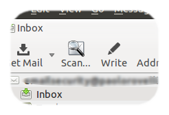

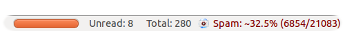

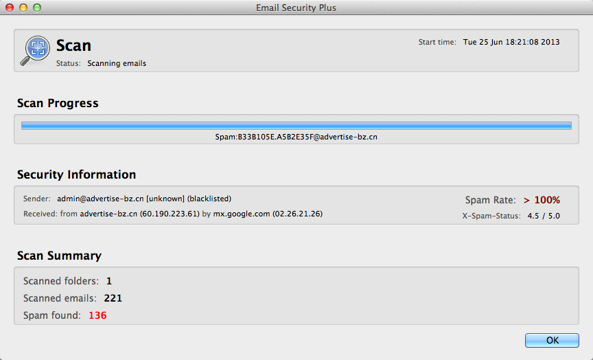

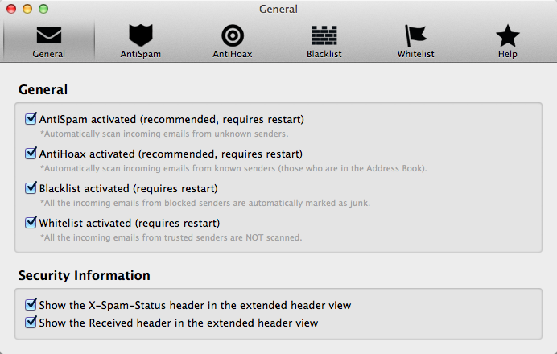

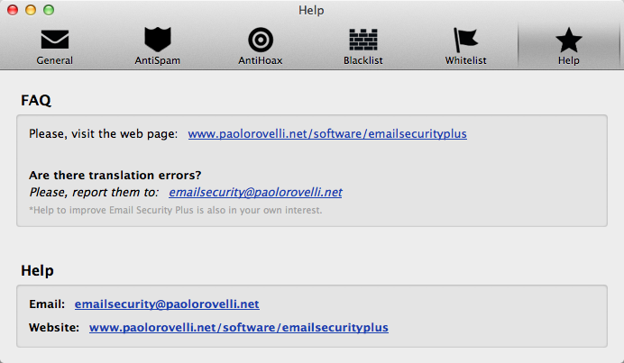

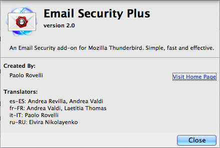